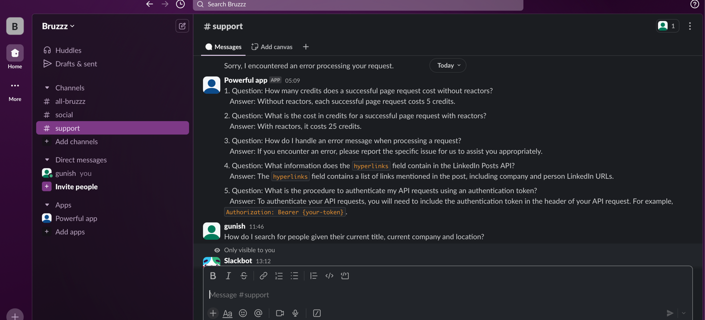
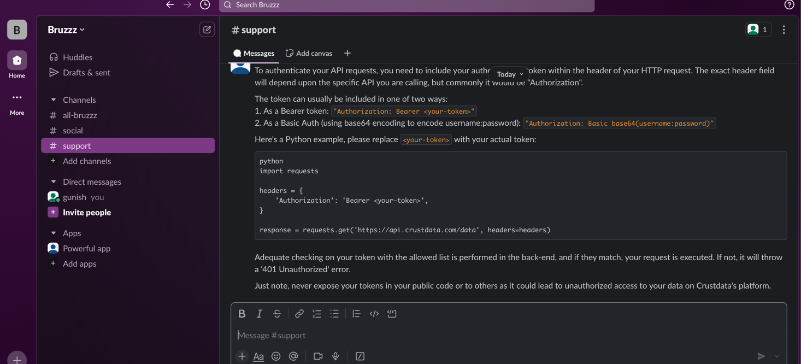
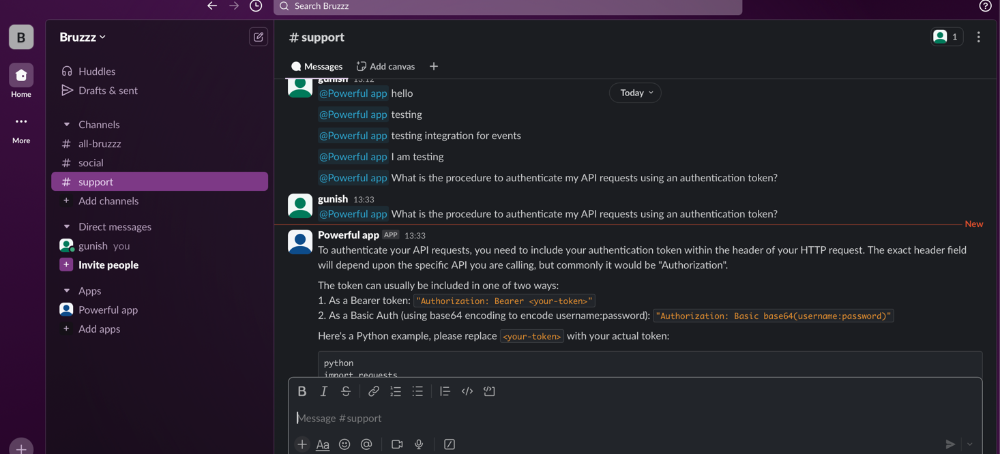

# Crustdata Customer Support Chatbot - Gunish Matta's Submission

An intelligent customer support chatbot designed to handle technical queries about Crustdata's APIs. 
Served via REST API to frontend and the bot also integrates with Slack validates API requests, and leverages an expandable knowledge base, aiming to provide accurate technical support.

## Features

### Level 0: Basic Static Chat
- Answers fundamental questions about Crustdata's APIs
- Processes queries using comprehensive API documentation
- Provides clear, documented responses to technical questions

### Level 1: Agentic Behavior
- Validates API requests in real-time
- Automatically identifies and fixes common request errors
- Supports multi-turn conversations within threads
- Maintains context for follow-up questions

### Level 2: Extended Knowledge Base
- Incorporates learning from historical support interactions
- Continuously updates documentation based on user queries
- Integrates new question-answer pairs from support channels
- Maintains an evolving knowledge repository

### Level 3: Slack Integration
- Seamlessly integrates with Slack workspaces
- Monitors specified channels for queries
- Provides real-time responses in threads
- Supports direct mentions and channel interactions

## Installation

1. Clone the repository
```bash
git clone https://github.com/gunishmatta/crustdata-chatbot.git
cd crustdata-chatbot
```

2. Install dependencies
```bash
pip install -r requirements.txt
```

3. Configure environment variables
Create a `.env` file in the project root:
```env
SLACK_TOKEN=your-slack-token
SLACK_APP_TOKEN=your-slack-app-token
```

4. Launch the application
```bash
python app/main.py
```

The server will start at `http://localhost:5001`

## Technology Stack

- **Backend Framework**: Flask
- **Slack Integration**: Slack Bolt Framework
- **Language**: Python 3.x
- **Response Generation**: RAG Pipeline built with Haystack and Azure Open AI GPT 4 Model
- **Documentation**: Markdown

Some of the challenges that I faced:
* Loading Data into Notion, I tried a few ways, used Notion's API but It doesn't works for Public Pages,
* tried Web scraping too but felt copying Notion file into my workspace file should be easy as my Notion 
* Integration doesn't hava access to CrustData's Notion, so copied and integrated Notion App to my Notion's DB.

After I was done with this, then I started with Haystack to build a standard programmatic RAG Pipeline,
First started with InMemoryLoaders to load the embeddings but moved to Qdrant due to its better capabilities,
Also for LLM tried ChatGPT, but its offers very few limits on free, tried LLAMA2 on Google Colab, was good but when I ran it on Local using OLLAMA,
it hanged up my Mac so moved on to choose, OpenAI's GPT4 model which I hosted on my personal Azure as I have a 500-600 INR credits.

Once I was done with basic Q&A setup and getting my basic integration to work, moved on to add API validator 
to validate API if it is coming from LLM response.

After this I moved to standardise data loaders and made them in a pluggable and abstract way.

Once this was ok, I integrated with Slack and tested Stack integrations too.

Code may look a bit messy but this is what I built in just 12 hours, I gave a challenge to myself and am happy I built it.


Also I would like to thank CrustData's Team for this amazing challenge.

Gunish

## Project Structure

```
crustdata-chatbot/
├── crustdata-chat-ui/ - UI for chatbot
├── app/
│   ├── __init__.py
│   ├── main.py          # Application entry point
│   ├── config.py          # Enviornment Variables and Config
├── ai/
│   ├── pipeline.py      # AI Pipeline - RAG and Ingestion
│   ├── ai.py             # AI Model - Open AI's GPT4
│   └── document_store.py # Qdrant Document Store for Embeddings
│   └── load_data.py # Script to load data
│   └── load_data.py # All Data Loaders (currently Slack Data loader, Notion Data lader)
│   └── api_validation.py # API Validation logic to validate LLM response.
├── .env                 # .env file for injecting env variables, putting a .env.template for sample
├── requirements.txt     # Dependencies
└── README.md           # Documentation

```


## Slack Setup Guide

1. Create a new Slack app through the [Slack API Dashboard](https://api.slack.com/apps)
2. Configure the following:
   - Enable Socket Mode for real-time messaging
   - Add required bot permissions
   - Install the app to your workspace
3. Copy the provided tokens to your `.env` file
4. Start the bot and verify its presence in designated channels

## Usage

The chatbot automatically monitors configured Slack channels and responds to:
- Direct mentions 
- Technical questions about the API
- API request validations
- Documentation queries

Users can continue conversations in threads, and the bot maintains context for follow-up questions.

Screenshots of working Slack Integration:
Initial Data Load into Slack for data source


Q&A with Slack Bot which interacts with AI agent




